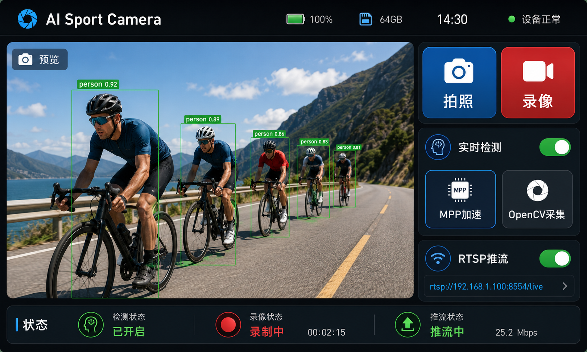
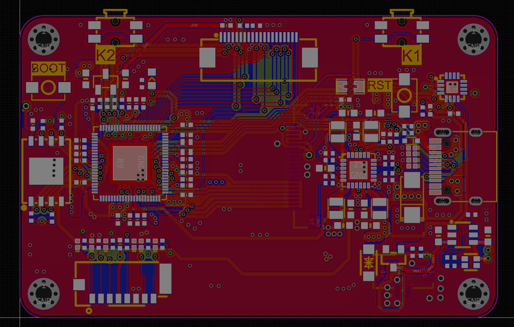
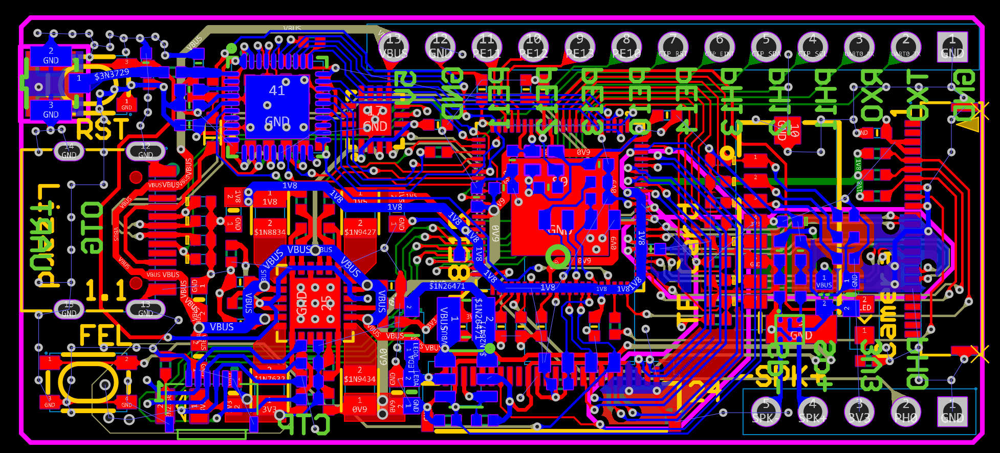

# V851S BSP 编译与开发指南

语言： [English](README.md) | **中文**

面向 **Allwinner V851S** 平台的 BSP 工程，包含板级配置、驱动补丁、OpenWrt/TinaTarget 适配、AI 相机应用示例以及 MPP / OpenCV / V4L2 相关开发参考。

程序可以在 Lizard 兼容开发板上运行；如果你有该开发板，也可以直接测试运行本项目。

> Application 主程序仍在持续迭代中，当前暂不开源。仓库中保留了 BSP、板端示例、MPP Demo 与外部模块，便于完成固件编译、功能验证和二次开发。

| Qt 界面预览 | DVP 硬件工程 |
| --- | --- |
|  |  |

<p align="center">
  
</p>

## 板级配置版本

仓库中保留了两套板级硬件工程与 BSP 覆盖包。两套 BSP 的板级目标均统一命名为 **nopiskl**。

| 版本 | 硬件工程 | BSP 覆盖包 | 优点 | 注意事项 |
| --- | --- | --- | --- | --- |
| DVP | `Hardware/Project_for_DVP` | `TinaSDKv5.0/Project_for_DVP` | 采用主线风格 LCD 驱动与 DVP 摄像头，不需要配置 ISP，调试更便捷。 | MPP 链路未完整测试，建议优先使用主程序的 OpenCV 功能。 |
| MIPI | `Hardware/Project_for_MIPI` | `TinaSDKv5.0/Project_for_MIPI` | 可使用主程序全部功能，支持 LCD 硬件加速与 AI_ISP，兼容 OpenCV 功能与 MPP 功能。 | 开发周期较长，对厂商 SDK 依赖更强。 |

## 项目特性

Application 以 **Qt** 作为界面管理框架，面向 AI Sport Camera 场景设计，覆盖拍照、录像、YOLO 实时检测、RTSP 推流等核心能力。

| 能力 | 说明 |
| --- | --- |
| 图形界面 | 基于 Qt 构建主界面，管理拍照、录像、预览与交互流程 |
| AI 检测 | 支持 YOLO 实时检测，包含 MPP 硬件加速链路与 OpenCV 原生捕获链路 |
| 视频处理 | 集成全志 MPP Pipeline，提升帧处理、编码与数据传输效率 |
| 网络推流 | 支持 RTSP 推流，便于远程预览和视频链路调试 |
| 开发示例 | 提供 OpenCV / V4L2 / ISP / MPP 示例，便于理解和迁移 |

## Application 主应用

`Application` 是 AI Sport Camera 的主进程工程，主要集成 MPP 处理链路、通用 OpenCV / V4L2 链路以及 Qt 界面逻辑。

Application 的设计目标是同时兼顾易用性与性能：

| 链路 | 优势 | 适用场景 |
| --- | --- | --- |
| OpenCV / V4L2 | 结构直观，迁移成本低，对 SoC 生态依赖弱 | 应用逻辑验证、快速二次开发 |
| MPP Pipeline | 深度利用全志 SoC 生态与硬件加速能力，性能更高 | 实时视频处理、编码推流、AI 相机主链路 |

Application 需要配合 MPP 模块开发。虽然组件库已单独拆分，不再强制依赖 Docker，但如果需要完整验证 MPP 相关能力，仍建议使用带 MPP 支持的 Docker 环境。

## 通用板端示例

MPP 链路功能完整但上手门槛较高，因此仓库中提供了两个更易迁移的板端示例，便于快速理解摄像头采集、AI 推理与 OpenCV 处理流程。

| 模块 | 路径 | 说明 |
| --- | --- | --- |
| YOLOv8 OpenCV 示例 | `TinaSDKv5.0/Project_for_DVP/openwrt/package/nopiskl/yolov8` 或 `TinaSDKv5.0/Project_for_MIPI/openwrt/package/nopiskl/yolov8` | 基于 OpenCV 实现 YOLOv8 识别与分类，未使用 MPP，帧率相对较低。默认编译进文件系统，可在板端终端直接运行，主进程 APP 也集成了该能力。 |
| YOLOv5 GC2053 示例 | `TinaSDKv5.0/Project_for_MIPI/nopiskl_external/yolov5_opencv_gc2053` | 基于 GC2053 摄像头，使用标准 V4L2 + ISP API 实现 YOLOv5 识别。该示例更贴近底层，需要一定嵌入式开发基础。 |

## MPP 模块

MPP 相关示例位于：

```text
Application/mpp
```

MPP 与 E907 开发包通常可在 Nopiskl 的AI_SecurityRecorder release中获取。使用方式可参考：

- [MPP 使用参考](https://forums.100ask.net/t/topic/3107)
- [E907 开发参考](https://forums.100ask.net/t/topic/7119)

如果希望研究 Application 的综合功能，或希望通过 MPP Pipeline 提升帧率与数据传输效率，需要使用带 MPP 支持的 Docker 环境。

`Application/mpp` 下的软件需复制到 MPP Demo 目录中启用。主进程 APP 的大部分视频链路、编码链路和推流能力均与 MPP 强相关。

## 构建路线

根据开发目标，建议在以下两种方式中选择：

| 方式 | 适用场景 | MPP 支持 | 推荐程度 |
| --- | --- | --- | --- |
| 全志开源社区 SDK | 需要从相对纯净的 BSP 环境开始验证 | 不包含完整 MPP 支持 | 一般 |
| Docker 环境 | 需要开发图像、视频、AI 推理与 MPP 加速能力 | 已预配置 MPP 支持 | 推荐 |

如果目标是开发 Application、MPP Pipeline、YOLO 实时检测或视频编解码相关功能，建议直接使用 Docker 方式。

详细构建步骤请参考：[构建说明](BUILD_README_CN.md)。

## 关键配置文件

| 类型 | 路径 |
| --- | --- |
| DVP 板级覆盖包 | `TinaSDKv5.0/Project_for_DVP/` |
| MIPI 板级覆盖包 | `TinaSDKv5.0/Project_for_MIPI/` |
| 设备树与板级配置 | `device/config/chips/v851s/configs/nopiskl/board.dts` |
| U-Boot 启动环境 | `device/config/chips/v851s/configs/nopiskl/env.cfg` |
| U-Boot defconfig | `brandy/brandy-2.0/u-boot-2018/configs/sun8iw21p1_defconfig` |
| 板端应用工程 | `openwrt/package/nopiskl/` |

> 不带 `TinaSDKv5.0/Project_for_*` 前缀的路径，是将其中一套覆盖包拷贝到 Tina SDK 根目录后的最终路径。

## 全志框架参考

全志平台使用自研 **disp 框架** 进行显示与图像处理，而不是 DRM；同时使用 **vin 框架** 管理 V4L2 各个 subdev。

建议结合以下资料理解 V851S 的媒体链路、驱动结构与 Tina SDK 使用方式：

- [Tina Linux 开发资料](https://tina.100ask.net/)
- [全志开源社区 SDK 获取指南](https://v853.docs.aw-ol.com/study/study_3getsdktoc/)
- [柚木 PI-V851S 开发资料](https://forums.100ask.net/t/topic/3009)
